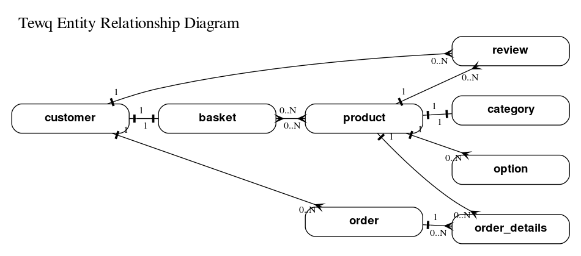

# Tewq

Me trying to apply what I have learned from [this book](https://www.dynamodbbook.com/), and also to learn more about "Serverless".

## DynamoDB Access Patterns

|  Access Patterns                                | By                     | Table/Index  | Key Condition                         | Filter Condition                                          |
| :---------------------------------------------: | :---------------       | :----------: | :-----------------------------------: | :-------------------------------------------------------: |
|  Get Users Orders                               |                        |              |                                       |                                                           |
|                                                 | by date and email      | Table        | GSIPK = emails                        | duartion > 0                                              |
|  Get Basket                                     |                        |              |                                       |                                                           |
|                                                 | by date and email      | Table        | GSIPK = emails                        | duartion > 0                                              |
|  Get Item                                       |                        |              |                                       |                                                           |
|                                                 | by id                  | Table        | PK = emails                           | duartion > 0                                              |
|                                                 | by category and price  | GSI1PK       | GSIPK = category, GI1SK price > 0     | stock > 0                                                 |


## Entity Relationship Diagram




## Testing

### Integration

1. Install [docker](https://www.docker.com/get-started).
2. Run `docker-compose up` at the root of the project, this will run DynamoDB locally.
3. You can now run `go test ./...` this will run all the tests.

**Test Tip**

* Download [NoSQL Workbench](https://docs.aws.amazon.com/amazondynamodb/latest/developerguide/workbench.html)

```go
  func TestSomethingInDynamoDB(t *testing.T) {

    tdb, _ := NewTestDynamoDB() // creates a table in your DynamoDB instance.
    is.NoErr(err)

    // If you comment out the Close method it will not delete the test database that got created.
    // This give you an opportunity to peek into the instance with NoSQL Workbench.
    // defer tdb.Close()
  }
```
